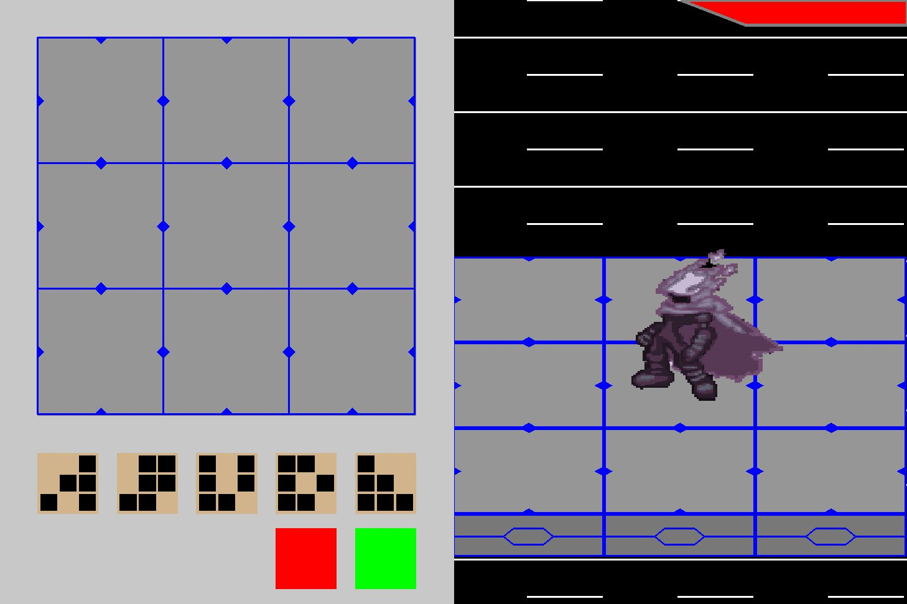
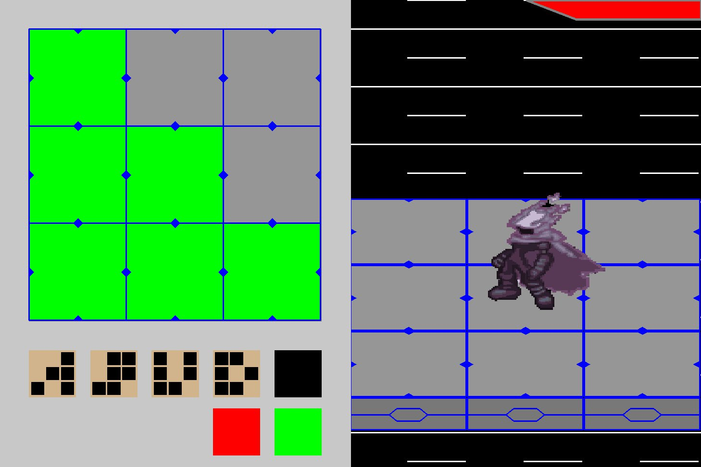
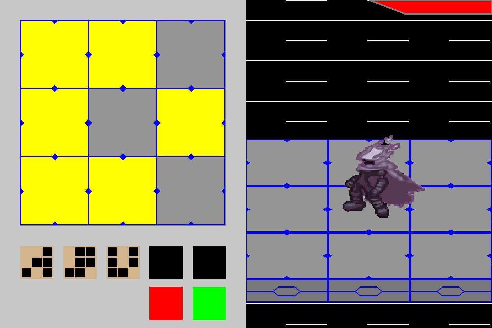
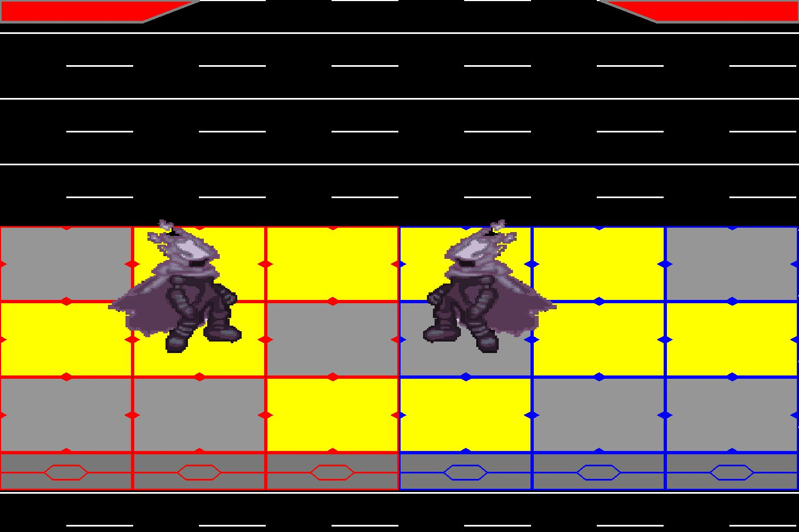
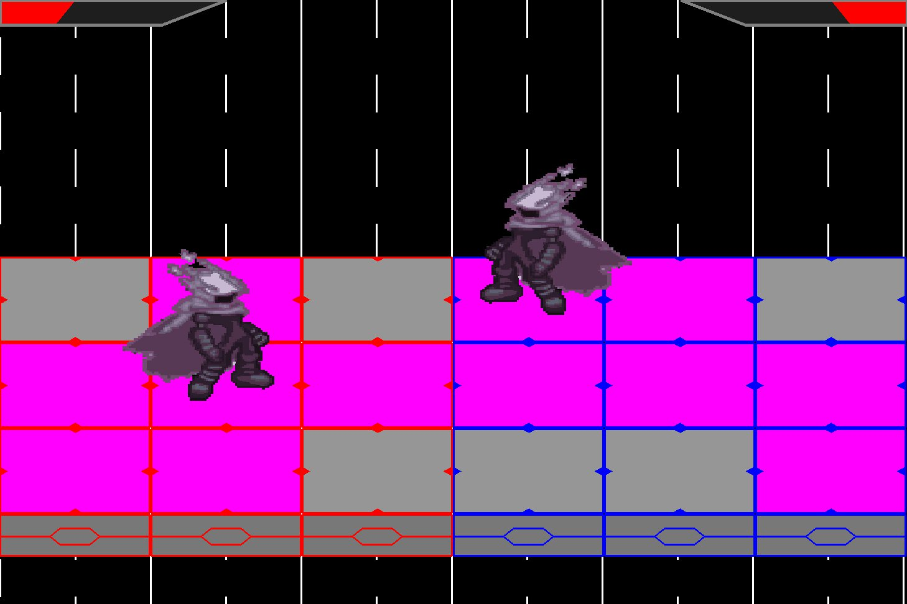
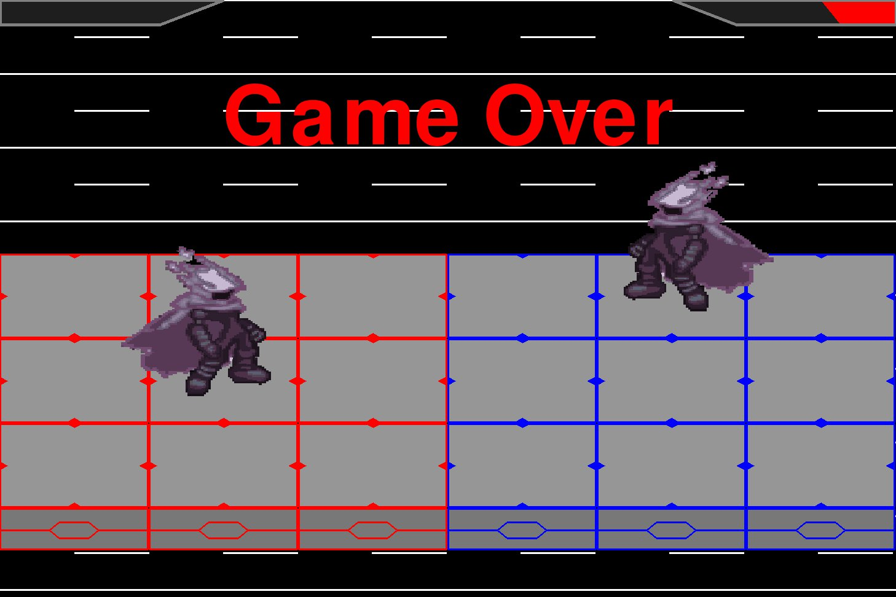

# Chain Strike

## Project Description
Chain Strike was inspired by the combat in the Mega Man Battle Network series. Combat in the Battle Network games placed the player on a 3x3 grid with the goal of selecting chips to attack their opponent on their grid. Chain Strike follows this core design but instead of the player being able to use their chips at will during the battle phase, selected chips are automatically used in order. Chaining chips in order to entrap or combo your opponent is the core of the combat loop (more in depth description in the gameplay section).

## Author Goals
- Gain experience in building/managing applications
- Practice object-oriented design principles

## Gameplay
### Chip Selection
  Upon starting a round, players will be presented a menu where they can select the order of their attacks.
\
  The first chip selected will highlight the panels it hits in green.
\
  Subsequent chips are highlighted in yellow.
\
  The player's selection can be cleared by clicking the red button and confirmed by clicking the green button. Once confirmed, combat will begin.
### Combat
  There are two phases to combat, a warning phase and a dodge phase. During the warning phase both players' chip selections are highlighted in yellow on the stage in order.
\
  After all selected chips have been highlighted, the dodge phase begins. The selected chips will be highlighted on the stage again (now in purple). If a player is on a highlighted panel they will lose one hitpoint.
\
  When a player has no remaining hitpoints the game ends and the player is sent back to the main menu.

## Roadmap
### Version 1.0.0
- Player vs. bot combat
- 210 unique chips

### What to Expect
- Custom folder creation
- Expanded chip variety
- Improved assets
- Peer-to-Peer play
