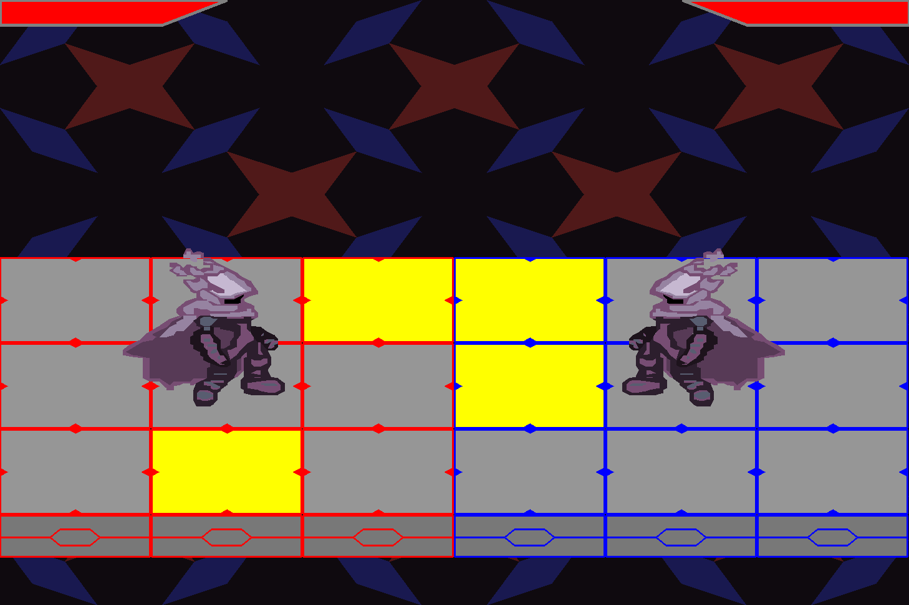

# Chain Strike
## Project Description
Chain Strike was inspired by the combat in the Mega Man Battle Network series. Combat in the Battle Network games placed the player on a 3x3 grid with the goal of selecting chips to attack their opponent on their grid. Chain Strike follows this core design but instead of the player being able to use their chips at will during the battle phase, selected chips are automatically used in order. Chaining chips in order to entrap or combo your opponent is the core of the combat loop (more in depth description in the gameplay section).

## Author Goals
- Gain experience in building/managing applications
- Practice object-oriented design principles
- Improve as a programmer

## Gameplay
### Chip Selection
  Upon starting a round, players will be presented a menu where they can select the order of their attacks. When selecting chips, players can choose between three variants: fast, standard, and slow. These variants determine how long a given chip will remain on stage. To use fast or slow varients, players must hold shift/ctrl respectively when selecting chips.

  Fast:

  Standard:

  Slow:

  Selected chips will appear in the preview window in the order they were selected and with the color of the variant used.

  The player's selection can be cleared by clicking the red button and confirmed by clicking the green button. Once confirmed, combat will begin.

### Combat
  There are two phases to combat, a warning phase and a dodge phase. During the warning phase both players' chip selections are highlighted in yellow on the stage in order.

  After all selected chips have been highlighted, the dodge phase begins. The selected chips will be highlighted on the stage again (now in purple). If a player is on a highlighted panel they will lose one hitpoint.

  When a player has no remaining hitpoints the game ends and the player is sent back to the main menu.

## Roadmap
### Version 1.0.0
- Player vs. bot combat
- 210 unique chips

### Version 2.0.0
- Custom folder creation
- Chip variants (fast, standard, and slow)
- Improved framerate (13 -> 20 fps)

### What to Expect
- Expanded chip variety
- Chip animations
- Movement animations
- More character designs
- Peer-to-Peer play
